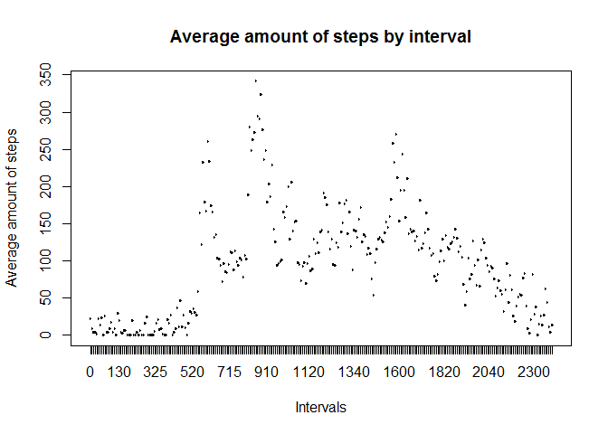
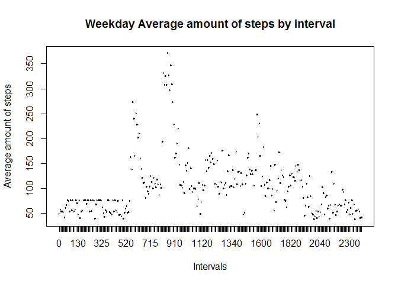
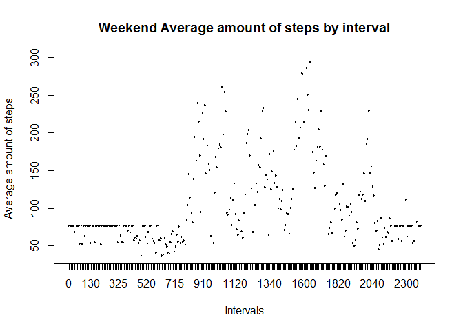

# Reproducible Research: Peer Assessment 1

The intention of this study is to process and analyze the information related to 
the activities being done by a subject in periods of time. This is now possible with the 
rise of new technologies and devices that let us access data that was too complex to get obtain in the past. In particular this study works in the analysis of 5 minute intervals that monitor the amount of steps of an anonymous individual each day from October to November 2012.

## Loading and preprocessing the data
The data is available is the activity.zip file. and can be loaded with the following instructions

```r
unzip("activity.zip")
activities <- read.csv("activity.csv")
```
Many of the questions answered here refer to daily information, the information was grouped 
and processed in a daily basis so we group and sum the amount of steps by day using the dplyr library.


```r
library(dplyr)
daily <- group_by(activities,date,steps)
daily <- summarize(daily)
```

The rest of the relevant information is contained if we observe based on the intervals of time of the different days the experiment took place, here we group the information by the different intervals of measurement.


```r
activities$interval <- as.factor(unique(activities$interval))
by.interval <- group_by(activities,interval,steps)
by.interval <- summarize(by.interval)
by.interval <- summarize_each(by.interval,funs(mean(.,na.rm = TRUE)))
```

## What is mean total number of steps taken per day?

The distribution of steps per day along the duration of the experiment is described by the following histogram


```r
hist(daily$steps,
     xlab = "Total Steps By day",
     col="blue",
     main = "Total number of steps taken each day")
```

 

The histogram shows us that we have several days that did not register any kind of activity, yet the remaining days give us a range of steps taken. After arranging the number of steps by day we can obtain the means of the steps the subject executed during the experiment


```r
  meanSteps <- mean(daily$steps,na.rm = T)
  medianSteps <- median(daily$steps,na.rm =T)
  meanSteps
```

```
## [1] 153.7217
```

```r
  medianSteps
```

```
## [1] 68
```


## What is the average daily activity pattern?

Throught a day, the average amount of steps in each 5-min time interval is displayed by the following figure.

 

The figure shows us a peak of steps between the intervals 800 and 900. We can obtain the interval that has the maximum amount of steps in an average day.


```r
maxStepRow <- which(by.interval$steps == max(by.interval$steps), arr.ind = T)
by.interval[maxStepRow,]
```

```
## Source: local data frame [1 x 2]
## 
##   interval    steps
##     (fctr)    (dbl)
## 1      835 341.4688
```

As a conclusion the individual that performed the activities has demanding activities during daylight.

## Imputing missing values

The measurements that were collected and placed in the file being analyzed in the current study presented several missing values


```r
length(which(is.na(activities$steps)))
```

```
## [1] 2304
```

In order to determine the values that the missing values represent where are going to use the mean amount of steps of the whole experiment. Furthermore, we are going to check if the usage of this value creates some sort of distortion in other values. The following figure shows us a histogram of the step activity by day after replacing the missing values with the mean.


```r
replaced.activities <- activities
replaced.activities[is.na(replaced.activities)] <- meanSteps
replaced.dateGrouped <- group_by(replaced.activities,date,steps)
replaced.dateGrouped <- summarize(replaced.dateGrouped)

hist(replaced.dateGrouped$steps,
     xlab = "Total Steps By day (replaced)",
     col="green",
     main="Total number of steps taken each day (replaced)")
```

 

After replacing the values we calculate the mean and median once again


```r
mean(replaced.dateGrouped$steps)
```

```
## [1] 153.7217
```

```r
median(replaced.dateGrouped$steps)
```

```
## [1] 68
```

After comparing them with the initial calculations where the missing values were present we can identify that there is no obvious difference in the mean and median previously calculated

## Are there differences in activity patterns between weekdays and weekends?

Using the data with the mean replacing the missing values we perform a comparison of the weekday and weekend step activity. We process and divide the days according if they were weekend or weekday.


```r
library(timeDate)
replaced.activities$date <- as.Date(replaced.activities$date)
replaced.activities$weekday <- isWeekday(replaced.activities$date,1:5)
replaced.activities$interval <- as.factor(unique(replaced.activities$interval))
weekdayPattern <- filter(replaced.activities,weekday==T)
weekendPattern <- filter(replaced.activities, weekday==F)
weekdayPattern <- group_by(weekdayPattern,interval,steps)
weekdayPattern <- summarize(weekdayPattern)
weekdayPattern <- summarize_each(weekdayPattern,funs(mean(.,na.rm = TRUE)))
weekendPattern <- group_by(weekendPattern,interval,steps)
weekendPattern <- summarize(weekendPattern)
weekendPattern <- summarize_each(weekendPattern,funs(mean(.,na.rm = TRUE)))
```

We generate a time series of the steps by interval for weekdays, and for weekends

 


 

After comparing the plots we can identify that weekends have a greater constant activity at the end of the day and the weekdays have greater activity during daylight. 
